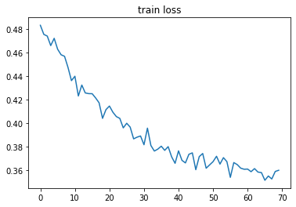
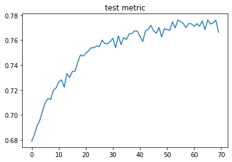

# U-Net: background removing

## Task
On input image with person remove the background.

Examples:

## Architecture of neural network

[Original paper](https://arxiv.org/abs/1505.04597)

All network can be split in two parts: Encoder and Decoder. 

The Encoder step by step down sample the input image. 
The result of the Encoder is feature tensor, which represents input image.
The Encoder itself can be split in the Blocks. Block contains two convolutional layers and activations ReLU.
Between blocks applying max-pooling
The result of each block of the Encoder will be sent in the Decoder, simply by concatenation, just like on image.
This move called skip connection.

Decoder step by step up sample the input feature tensor and in the end it returns mask of image.
The Decoder can be splits into the Blocks too, and the Block by the structure will be the same.
Between blocks applying 
[transpose convolution](https://towardsdatascience.com/what-is-transposed-convolutional-layer-40e5e6e31c11).

[Link to download the model from Google Drive](https://drive.google.com/file/d/14VbcaW9zPq0uE4QrwYt81vf6eWM3CA2N/view?usp=sharing)

## Data

Train dataset is [Microsoft COCO](https://cocodataset.org/#home)

## Result metrics

Jaccard index = 0.7663

Cross entropy loss = 0.3599

Curves of training

## Used modules

[pycocotools](https://github.com/cocodataset/cocoapi) For interacting with COCO dataset

[torch](https://pytorch.org/) For neural networks training

[torchvision](https://pytorch.org/vision/stable/index.html) For performing a data augmentation and interacting with torch tensors

[torchmetrics](https://torchmetrics.readthedocs.io/en/stable/) For metrics, jaccard index, for example

[matplotlib](https://matplotlib.org/) For plotting graphs and images
